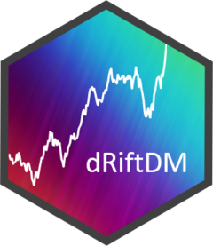

<!-- badges: start -->

[](https://cran.r-project.org/package=dRiftDM)
[](https://cran.r-project.org/package=dRiftDM)
[](https://github.com/bucky2177/dRiftDM)
[](https://app.codecov.io/gh/bucky2177/dRiftDM)
[](https://github.com/bucky2177/dRiftDM/actions/workflows/R-CMD-check.yaml)
[](https://github.com/bucky2177/dRiftDM)
[](https://doi.org/10.31219/osf.io/3t2vf)
<!-- badges: end -->

# dRiftDM 

The package dRiftDM was developed to assist psychology researchers in
applying and fitting diffusion models to empirical data within the R
environment. Its most important feature is the ability to handle
non-stationary problems, specifically diffusion models with
time-dependent parameters (such as a drift rate that changes over the
course of a trial). The package includes essential tools for standard
analyses, such as building models, estimating parameters for multiple
participants, and creating/visualizing summary statistics. The pre-built
models available in the package are:

- The Standard **Ratcliff Diffusion Model** (Ratcliff, 1978,
  Psychological Review)
- The **Diffusion Model for Conflict Tasks** (Ulrich et al., 2015,
  Cognitive Psychology)
- The **Shrinking Spotlight Model** (White et al., 2011, Cognitive
  Psychology)

We can flexibly create custom models and utilize the dRiftDM machinery
to estimate them. Variability in the starting point and non-decision
time is generally supported. Variability in the drift rate is also
supported, although it is limited to models with a
time-independent/constant drift rate. Model components for a collapsing
boundary are already pre-built. Demos for model customization are
provided in one of our
[vignettes](https://bucky2177.github.io/dRiftDM/articles/customize_ddms.html).

Model predictions (i.e., first-passage times) are derived by numerically
solving the Kolmogorov-Forward equation (KFE) using a time-adaptive
procedure (i.e., the time-step size is adjusted dynamically and this
leads to substantial speed-up). This is the default, and we currently
recommend keeping it that way.

For backward compatibility, it is also possible to derive the
first-passage-time distribution via a coupled set of integral equations.
However, this method does not yet support adaptive time stepping. Thus,
finer discretization settings are necessary, and it will generally run
slower than the approach based on the KFE.

Mathematical details of both approaches are provided in [Richter et
al.](https://doi.org/10.1016/j.jmp.2023.102756) (2023, *Journal of
Mathematical Psychology*).

## Installation

You can install the development version of dRiftDM from
[GitHub](https://github.com/) with:

``` r
# install.packages("devtools")
devtools::install_github("bucky2177/dRiftDM")
```

The [CRAN](https://cran.r-project.org/) version can be installed with:

``` r
install.packages("dRiftDM")
```

## Notes

Compared to the initial version 0.1.1, versions \>=0.2.0 make greater
use of the S3 object system. Additionally, beginning with version 0.2.0,
models use `flex_prms` objects to handle parameters across conditions.

In versions \>=0.3.0, we implemented a more efficient KFE-based solver,
which led to a **substantial speed-up**. We also added several new
features:

- different optimization algorithms (including unbounded Nelder-Mead and
  BFGS)
- different cost functions (with the root-mean-square error, RMSE, as an
  alternative to the log-likelihood)
- default parameter ranges for pre-built models
- visualizing the full distribution of a model and calculating basic
  summary statistics
- calculating/visualizing uncertainty intervals via bootstrap-like
  procedures
- fitting a model to aggregated data using the RMSE statistic
- fitting a model via hierarchical and non-hierarchical Bayesian
  estimation (currently experimental and not fully connected to all of
  dRiftDM’s features)

To install one of the older versions (0.1.1, 0.2.1, 0.2.2), you can use:

``` r
devtools::install_github("bucky2177/dRiftDM", ref = "<insert version>")
```

## How to use dRiftDM

If you are interested in getting started with dRiftDM, we recommend
reading the [OSF pre-print](https://osf.io/preprints/osf/3t2vf). More
information on functions and model customization can be found in
dRiftDM’s vignettes. These vignettes are also available from the
“Getting started” and “Articles” tabs on our [Github.io
page](https://bucky2177.github.io/dRiftDM/).

If you have any questions, feel free to contact us!
