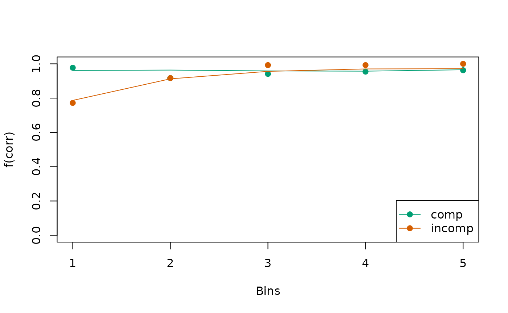
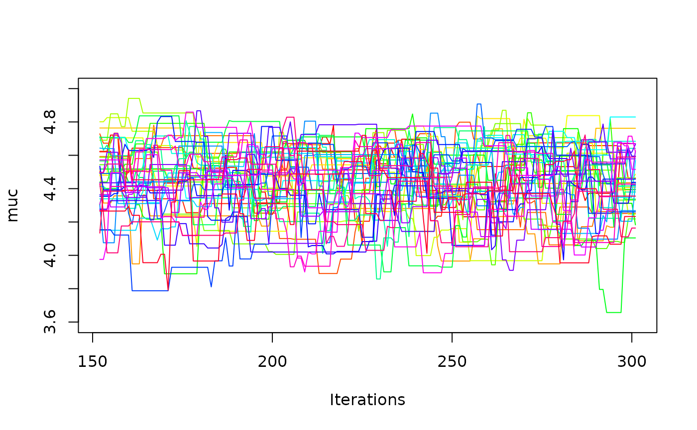
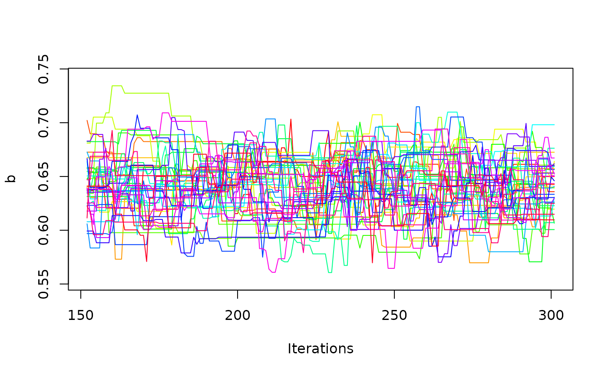

# Introduction to dRiftDM

When working with drift-diffusion models (DDMs) you probably want to:

- Build a new model or select an existing model

- Explore the model behavior and validate that model parameters are
  estimated reliably

- Fit the model to data

- Explore the model fit

The dRiftDM package helps you to do this:

- With dedicated functions and workflows

- Options to customize models

- With efficient algorithms to derive the model predictions for
  time-dependent DDMs (see Richter, Ulrich, and Janczyk 2023)

Three pre-built models are currently available:

- The Ratcliff Diffusion Model (see
  [`ratcliff_dm()`](https://bucky2177.github.io/dRiftDM/reference/ratcliff_dm.md),
  Ratcliff 1978)

- The Diffusion Model for Conflict Tasks (see
  [`dmc_dm()`](https://bucky2177.github.io/dRiftDM/reference/dmc_dm.md),
  Ulrich et al. 2015; Janczyk, Mackenzie, and Koob 2024)

- The Shrinking Spotlight Model (see
  [`ssp_dm()`](https://bucky2177.github.io/dRiftDM/reference/ssp_dm.md),
  White, Ratcliff, and Starns 2011)

This document introduces you to dRiftDM, focusing on first steps in
exploring and fitting a DDM.

### An Examplary Model

To explore some of the basic functions of dRiftDM, we’ll use the
Diffusion Model for Conflict Tasks (DMC). It is a diffusion model
commonly employed in the context of cognitive psychology. To create the
model, we call the pre-built function `dmc_fun()` and assign its output
to a variable:

``` r
ddm <- dmc_dm()
```

### Basic Properties of a Model

When printing a model to the console, we obtain detailed information
about it:

``` r
print(ddm)
#> Class(es) dmc_dm, drift_dm
#> (model has not been estimated yet)
#> 
#> Parameter Values:
#>        muc   b non_dec sd_non_dec  tau a    A alpha
#> comp     4 0.6     0.3       0.02 0.04 2  0.1     4
#> incomp   4 0.6     0.3       0.02 0.04 2 -0.1     4
#> 
#> Parameter Settings:
#>        muc b non_dec sd_non_dec tau a A alpha
#> comp   1   2 3       4          5   0 6 7    
#> incomp 1   2 3       4          5   0 d 7    
#> 
#> Special Dependencies:
#> A ~ incomp == -(A ~ comp)
#> 
#> Custom Parameters:
#>        peak_l
#> comp     0.04
#> incomp   0.04
#> 
#> Deriving PDFS:
#>   solver: kfe
#>   values: sigma=1, t_max=3, dt=0.0075, dx=0.02, nt=400, nx=100
#> 
#> Cost Function: neg_log_like
#> 
#> Observed Data: NULL
```

Here we get a glimpse on the underlying structure of any model created
with dRiftDM. For DMC this is:

- The model is of type `dmc_dm`

- The model has the parameters `muc`, `b`, …, `alpha`, and the current
  parameter values for each conditions are shown under
  `Parameter Values`. The conditions are `comp` and `incomp` in this
  case.

- Below this, under `Parameter Settings`, we obtain how each parameter
  behaves across conditions. If a number is the same for a parameter
  across conditions, this means that this parameter is equated across
  conditions. For example, the parameter `muc` is assumed to be
  identical for the conditions `comp` and `incomp`. If a number is zero,
  this means that this parameter is assumed to be “fixed” and thus is
  not a “free” parameter that can be estimated. If an entry shows a “d”,
  this means there is a special dependency, as listed under
  `Special Dependencies` (see
  [`vignette("customize_ddms", "dRiftDM")`](https://bucky2177.github.io/dRiftDM/articles/customize_ddms.md)
  for more information).

- When fitting or exploring a model, we will have to derive the model
  predictions in terms of the first-passage-times (i.e., the duration of
  central response selection in the context of psychology). The settings
  for this are shown under `Deriving PDFs`. Currently, predictions are
  derived by a numerical discretization of the
  Kolmogorov-Forward-Equation (`kfe`). The diffusion constant `sigma` is
  1, the maximum time space is 3 seconds, and the discretization in time
  and space is done in steps of .0075 and .02, respectively.

- Finally, under `Cost Function`, we can see the goal function that is
  used to compare observed data (not yet part of the model) and the
  model predictions. Per default, this cost function is the
  `negative log-likelihood`.

## Exploring a Model

To explore a model, dRiftDM provides:

- [`simulate_traces()`](https://bucky2177.github.io/dRiftDM/reference/simulate_traces.md)
  simulates realizations of the diffusion process

- [`calc_stats()`](https://bucky2177.github.io/dRiftDM/reference/calc_stats.md)
  calculates summary statistics of model predictions

### `simulate_traces()`

Realizations of a diffusion process, that is, single evidence
accumulation *traces* for central response selection, are common ways to
visualize a diffusion model. The first argument requires the model
object. The second argument requires the number of realizations to
simulate.

For example, we could simulate 5 traces for DMC per condition:

``` r
five_traces <- simulate_traces(object = ddm, k = 5)
five_traces
#> Class(es): traces_dm_list
#> 
#> Time space:
#> 0.000, 0.007, 0.015, 0.022 ... 3.000 
#> 
#> Condition: comp 
#> ~>  0.000, -0.040,  0.046, -0.113 ...  0.664 
#> ~>  0.000,  0.008, -0.011,  0.129 ...  0.660 
#> ~>  0.000,  0.036,  0.174,  0.255 ...  0.634 
#> ~>  0.000,  0.020,  0.067,  0.184 ...  0.773 
#> ...
#> 
#> Condition: incomp 
#> ~>  0.000, -0.073, -0.105, -0.070 ...  0.656 
#> ~>  0.000,  0.048,  0.106,  0.087 ...  0.665 
#> ~>  0.000, -0.013,  0.023, -0.046 ...  0.621 
#> ~>  0.000,  0.015, -0.091, -0.080 ...  0.610 
#> ...
```

Per default, traces are simulated by assuming a fixed starting value of
zero. To simulate traces with a variable starting point (if provided by
model), we can set the argument `add_x = TRUE`:

``` r
five_traces <- simulate_traces(object = ddm, k = 5, add_x = TRUE)
five_traces
#> Class(es): traces_dm_list
#> 
#> Time space:
#> 0.000, 0.007, 0.015, 0.022 ... 3.000 
#> 
#> Condition: comp 
#> ~> -0.288, -0.141, -0.166, -0.188 ...  0.647 
#> ~> -0.168,  0.024, -0.022,  0.026 ...  0.633 
#> ~>  0.144,  0.018,  0.060,  0.150 ...  0.672 
#> ~>  0.072,  0.279,  0.460,  0.487 ...  0.682 
#> ...
#> 
#> Condition: incomp 
#> ~> -0.144, -0.178, -0.149, -0.097 ...  0.686 
#> ~> -0.192, -0.067, -0.054, -0.059 ...  0.632 
#> ~>  0.264,  0.023, -0.088,  0.014 ...  0.630 
#> ~> -0.024, -0.078, -0.165, -0.167 ...  0.679 
#> ...
```

In the context of DMC, starting values of the traces are drawn from a
symmetric beta distribution (see Ulrich et al. 2015).

We can easily visualize these traces by calling the generic
[`plot()`](https://rdrr.io/r/graphics/plot.default.html) method:

``` r
plot(five_traces, col = c("green", "red"))
```


If you would like diffusion processes with a higher temporal resolution
(e.g., for a nice publication-ready figure), simply increase `dt` (see
the next chapter below) and run
[`simulate_traces()`](https://bucky2177.github.io/dRiftDM/reference/simulate_traces.md)
once more.

When visualizing the basic model behavior, one sometimes wants to
display the expected time-course of the diffusion process. We can do so
by eliminating the stochastic noise with setting the argument
`sigma = 0`.

``` r
exp_behavior <- simulate_traces(object = ddm, k = 1, sigma = 0)
plot(exp_behavior, col = c("green", "red"))
```


Note: When deriving the diffusion processes, `dRiftDM` simply uses the
Euler-Maruyama method with a fixed time step size of `dt`. When actually
deriving model predictions via the Kolmogorov-Forward-Equation, however,
`dRiftDM` uses a dynamic time-stepping scheme to ensure high numerical
accuracy even with relatively coarse settings for `dt`. Thus, if the
model’s drift rate varies strongly and `dt` is large, the expected time
course via
[`simulate_traces()`](https://bucky2177.github.io/dRiftDM/reference/simulate_traces.md)
might not match the predicted model behavior.

### `calc_stats()`

A DDM predicts response choices and response times, with the latter
being the sum of the first-passage-time (i.e., the duration of central
response selection) and the non-decision time. We can request summary
statistics of this prediction with
[`calc_stats()`](https://bucky2177.github.io/dRiftDM/reference/calc_stats.md).
The first argument requires the model object. The second argument a
character vector, specifying the `type` of summary statistic.

In the context of cognitive psychology, quantiles and so-called
Conditional Accuracy Functions (CAFs) are common ways to summarize the
model predictions:

``` r
sum_stats <- calc_stats(object = ddm, type = c("cafs", "quantiles"))
sum_stats
#> Element 1, contains cafs
#> 
#>    Source   Cond Bin P_corr
#> 1    pred   comp   1  0.983
#> 2    pred   comp   2  0.983
#> 3    pred   comp   3  0.981
#> 4    pred   comp   4  0.984
#> 5    pred   comp   5  0.989
#> 6    pred incomp   1  0.835
#> 7    pred incomp   2  0.971
#> 8    pred incomp   3  0.986
#> 9    pred incomp   4  0.991
#> 10   pred incomp   5  0.992
#> 
#> 
#> Element 2, contains quantiles
#> 
#>    Source   Cond Prob Quant_corr Quant_err
#> 1    pred   comp  0.1      0.325     0.321
#> 2    pred   comp  0.2      0.346     0.343
#> 3    pred   comp  0.3      0.364     0.362
#> 4    pred   comp  0.4      0.384     0.380
#> 5    pred   comp  0.5      0.406     0.398
#> 6    pred   comp  0.6      0.433     0.419
#> 7    pred   comp  0.7      0.465     0.443
#> 8    pred   comp  0.8      0.507     0.476
#> 9    pred   comp  0.9      0.574     0.531
#> 10   pred incomp  0.1      0.352     0.301
#> ...
#> 
#> (extract the list's elements as usual, e.g., with $cafs)
```

We can visualize summary statistics with the
[`plot()`](https://rdrr.io/r/graphics/plot.default.html) method:

``` r
plot(sum_stats)
```


It is also possible to plot the predicted response time distributions
using `type = "densities"`.

``` r
sum_stats <- calc_stats(object = ddm, type = c("densities"))
sum_stats
#> Type of Statistic: densities
#> 
#>    Source Cond Stat  Time Dens_corr Dens_err
#> 1    pred comp  pdf 0.000         0        0
#> 2    pred comp  pdf 0.007         0        0
#> 3    pred comp  pdf 0.015         0        0
#> 4    pred comp  pdf 0.022         0        0
#> 5    pred comp  pdf 0.030         0        0
#> 6    pred comp  pdf 0.038         0        0
#> 7    pred comp  pdf 0.045         0        0
#> 8    pred comp  pdf 0.052         0        0
#> 9    pred comp  pdf 0.060         0        0
#> 10   pred comp  pdf 0.068         0        0
#> ...
#> 
#> (access the data.frame's columns/rows as usual)
```

In this case, it’s often helpful to plot the distributions separately
for each condition, so they don’t overlap too much:

``` r
plot(sum_stats, conds = "comp", xlim = c(0, 1.0))
```


``` r
plot(sum_stats, conds = "incomp", xlim = c(0, 1.0))
```


## Changing Model Properties

To get or set properties of the model, dRiftDM provides
accessor/replacement methods for:

- [`coef()`](https://rdrr.io/r/stats/coef.html) accesses/replaces
  parameter values

- [`prms_solve()`](https://bucky2177.github.io/dRiftDM/reference/prms_solve.md)
  accesses/replaces settings for deriving model predictions (this also
  includes changing the diffusion constant)

- [`solver()`](https://bucky2177.github.io/dRiftDM/reference/solver.md)
  accesses/replaces the method for deriving model predictions (not
  really necessary anymore, the default `kfe` is well enough!)

- [`b_coding()`](https://bucky2177.github.io/dRiftDM/reference/b_coding.md)
  accesses/replaces the coding of the upper and lower boundary

- [`obs_data()`](https://bucky2177.github.io/dRiftDM/reference/obs_data.md)
  accesses/replaces the data set (of a single participant) attached to
  the model

- [`flex_prms()`](https://bucky2177.github.io/dRiftDM/reference/flex_prms.md)
  accesses/replaces the object that controls how each parameter relates
  across conditions

- [`conds()`](https://bucky2177.github.io/dRiftDM/reference/conds.md)
  accesses/replaces the conditions of a model

- [`comp_funs()`](https://bucky2177.github.io/dRiftDM/reference/comp_funs.md)
  accesses/replaces the underlying component functions for the drift
  rate, boundary, etc.

- [`cost_function()`](https://bucky2177.github.io/dRiftDM/reference/cost_function.md)
  accesses/replace the cost function used for parameter optimization.

Note:
[`comp_funs()`](https://bucky2177.github.io/dRiftDM/reference/comp_funs.md),
[`flex_prms()`](https://bucky2177.github.io/dRiftDM/reference/flex_prms.md),
and [`conds()`](https://bucky2177.github.io/dRiftDM/reference/conds.md)
are covered in
[`vignette("customize_ddms", "dRiftDM")`](https://bucky2177.github.io/dRiftDM/articles/customize_ddms.md).

### `coef()`

``` r
coef(ddm)
#>        muc          b    non_dec sd_non_dec        tau          A      alpha 
#>       4.00       0.60       0.30       0.02       0.04       0.10       4.00
```

This returns a unique representation of the parameters and their
associated values. Note that this drops parameters that are not
estimable.

We can combine [`coef()`](https://rdrr.io/r/stats/coef.html) with the
`[]` operator to change the values of the parameters:

``` r
coef(ddm)["muc"] <- 5
coef(ddm)
#>        muc          b    non_dec sd_non_dec        tau          A      alpha 
#>       5.00       0.60       0.30       0.02       0.04       0.10       4.00
```

To request the entire parameter matrix with all parameter values across
conditions, we can set the argument `select_unique = FALSE`:

``` r
coef(ddm, select_unique = FALSE)
#>        muc   b non_dec sd_non_dec  tau a    A alpha peak_l
#> comp     5 0.6     0.3       0.02 0.04 2  0.1     4   0.04
#> incomp   5 0.6     0.3       0.02 0.04 2 -0.1     4   0.04
```

In this case, we can not combine
[`coef()`](https://rdrr.io/r/stats/coef.html) with the `[]` operator. To
change a parameter value for a specific condition, we can use the
function
[`modify_flex_prms()`](https://bucky2177.github.io/dRiftDM/reference/modify_flex_prms.md).

### `prms_solve()`

``` r
prms_solve(ddm)
#>   sigma   t_max      dt      dx      nt      nx 
#> 1.0e+00 3.0e+00 7.5e-03 2.0e-02 4.0e+02 1.0e+02
```

This shows the diffusion constant and the discretization settings. We
can again use a combination with `[]` to modify these values.

``` r
prms_solve(ddm)["dt"] <- .005
prms_solve(ddm)
#> sigma t_max    dt    dx    nt    nx 
#> 1e+00 3e+00 5e-03 2e-02 6e+02 1e+02
```

### Remark: Discretization Settings

Setting the discretization, in particluar for `dt` and `dx`, is a tricky
choice. If you create a new model (see the
[`vignette("customize_ddms", "dRiftDM")`](https://bucky2177.github.io/dRiftDM/articles/customize_ddms.md)),
dRiftDM discretizes the time and evidence space in steps of
`dx = dt = 0.001`. This is a very conservative setting, ensuring high
numerical accuracy for many DDMs. Yet, this high numerical accuracy
comes at the expense of a high computational burden that increases
non-linearly.

For the models that are pre-built (i.e., for
[`dmc_dm()`](https://bucky2177.github.io/dRiftDM/reference/dmc_dm.md),
[`ssp_dm()`](https://bucky2177.github.io/dRiftDM/reference/ssp_dm.md),
and
[`ratcliff_dm()`](https://bucky2177.github.io/dRiftDM/reference/ratcliff_dm.md)),
we have conducted extensive simulations to find a discretization that
provides a good balance between speed and accuracy. However, these
settings will not hold for all models that you might create with
`dRiftDM`. It is thus highly recommended for custom models to perform
some exploratory model simulations under different discretization and
parameter setttings. As a rule of thumb, we currently recommend
exploring `dt` values between 0.001 and 0.01, and `dx` values between
0.001 and 0.02.

Another choice is the maximum time space. It should be large enough to
easily cover the longest response time in the observed data set.

A helpful function to check the impact of the discretization setting, in
particular for `dt` and `dx` is the
[`check_discretization()`](https://bucky2177.github.io/dRiftDM/reference/check_discretization.md)
function. This function takes a model (with some values for `dt` and
`dx`) and compares the model predictions with these settings against
model predictions obtained under very fine discretization settings using
the Hellinger-Distance.

``` r
check_discretization(ddm)
#>    comp  incomp 
#> 0.01027 0.01431
```

we can interpret the result as a percentage of deviance. If the model
predictions under fine and a more coarse settings are exactly the same,
the returned values will be zero. If they are completely different, they
will be one. From our own (yet preliminary) experience, we would
recommend keeping the Hellinger Distance clearly below 5 percent for
most of the relevant parameter settings.

### `solver()`

``` r
solver(ddm)
#> [1] "kfe"
```

This shows the currently set method for deriving the model’s predicted
probability density functions of response time and choice. Currently
supported options are `"kfe"` and `"im_zero"`. While the `"kfe"` method
can be applied to all models in dRiftDM, `"im_zero"` can only be used
when the starting point is fixed to zero. Also, `"im_zero"` currently
doesn’t support adaptive time stepping, and requires finer
discretization. Thus, for now, `"im_zero"` is only present for backward
compatibility, and we recommend using the `"kfe"` solver.

### `b_coding()`

``` r
b_coding(ddm)
#> $column
#> [1] "Error"
#> 
#> $u_name_value
#> corr 
#>    0 
#> 
#> $l_name_value
#> err 
#>   1
```

This returns a list that specifies how the boundaries of a DDM are
coded. We can change the boundary coding by modifying the returned list:

``` r
copy <- ddm # to not change the original model object
b_coding(copy)$column <- "Response"
b_coding(copy)$u_name_value <- c("left" = -1)
b_coding(copy)$l_name_value <- c("right" = 1)

b_coding(copy)
#> $column
#> [1] "Response"
#> 
#> $u_name_value
#> left 
#>   -1 
#> 
#> $l_name_value
#> right 
#>     1
```

Changing the boundary coding makes sense if the response choices of your
observed data is not accuracy coded.

Note that this will also alter the column names of the summary
statistics:

``` r
calc_stats(copy, "quantiles")
#> Type of Statistic: quantiles
#> 
#>    Source   Cond Prob Quant_left Quant_right
#> 1    pred   comp  0.1      0.321       0.310
#> 2    pred   comp  0.2      0.339       0.327
#> 3    pred   comp  0.3      0.355       0.342
#> 4    pred   comp  0.4      0.371       0.357
#> 5    pred   comp  0.5      0.388       0.373
#> 6    pred   comp  0.6      0.408       0.390
#> 7    pred   comp  0.7      0.433       0.409
#> 8    pred   comp  0.8      0.466       0.435
#> 9    pred   comp  0.9      0.517       0.476
#> 10   pred incomp  0.1      0.345       0.297
#> ...
#> 
#> (access the data.frame's columns/rows as usual)
```

### `obs_data()`

We can set observed data of a single individual to a model (or access
it) with
[`obs_data()`](https://bucky2177.github.io/dRiftDM/reference/obs_data.md).
When setting observed data, we have to make sure that the supplied
`data.frame` provides columns matching with the boundary coding and the
conditions of the model.

``` r
data <- dRiftDM::dmc_synth_data # some synthetic data suitable for DMC that ships with dRiftDM
# the Cond column matches with conds(ddm).
# The Error column matches b_coding(ddm)
# the RT column is in seconds ;)
head(data)
#>      RT Error Cond
#> 1 0.349     0 comp
#> 2 0.444     0 comp
#> 3 0.441     0 comp
#> 4 0.572     0 comp
#> 5 0.438     0 comp
#> 6 0.535     0 comp

obs_data(ddm) <- data
```

Note that the supplied data set is not stored “as is” within the model
object. Thus, when accessing a data set of a model, the data is
re-assembled, and this might change the order of rows or column with
respect to the original data set. To remind you of that, a message is
thrown.

``` r
extr_data <- obs_data(ddm)
#> Extracting observed data from a model object. Remember that the result may be sorted differently than expect!
head(extr_data)
#>      RT Error Cond
#> 1 0.349     0 comp
#> 2 0.444     0 comp
#> 3 0.441     0 comp
#> 4 0.572     0 comp
#> 5 0.438     0 comp
#> 6 0.535     0 comp
```

### The `summary()` Function

We can request a detailed summary of the model, providing information
about it’s core properties with the generic
[`summary()`](https://rdrr.io/r/base/summary.html) function:

``` r
summary(ddm)
#> Class(es) dmc_dm, drift_dm
#> 
#> Parameter Values:
#>        muc   b non_dec sd_non_dec  tau a    A alpha
#> comp     5 0.6     0.3       0.02 0.04 2  0.1     4
#> incomp   5 0.6     0.3       0.02 0.04 2 -0.1     4
#> 
#> Parameter Settings:
#>        muc b non_dec sd_non_dec tau a A alpha
#> comp   1   2 3       4          5   0 6 7    
#> incomp 1   2 3       4          5   0 d 7    
#> 
#> Special Dependencies:
#> A ~ incomp == -(A ~ comp)
#> 
#> Custom Parameters:
#>        peak_l
#> comp     0.04
#> incomp   0.04
#> 
#> Observed Data:
#>              min. 1st qu. median  mean 3rd qu.  max.   n
#> corr comp   0.331   0.436  0.479 0.507   0.549 1.075 292
#> corr incomp 0.313   0.474  0.528 0.543   0.592 0.879 268
#> err comp    0.428   0.458  0.526 0.564   0.621 0.871   8
#> err incomp  0.302   0.398  0.452 0.458   0.498 0.771  32
#> 
#> Fit Indices:
#>     Log_Like Neg_Log_Like          AIC          BIC       RMSE_s      RMSE_ms 
#>     -180.145      180.145      374.290      405.069        0.107      106.502 
#> 
#> -------
#> Deriving PDFS:
#>   solver: kfe
#>   values: sigma=1, t_max=3, dt=0.005, dx=0.02, nt=600, nx=100
#> 
#> Boundary Coding:
#>   upper: corr 
#>   lower: err 
#>   expected data column: Error (corr = 0; err = 1)
```

## Fitting a Model

To fit a model to observed data we can use
[`estimate_dm()`](https://bucky2177.github.io/dRiftDM/reference/estimate_dm.md).
We can choose between:

- Fitting a model separately to multiple participants using classical
  optimization (i.e., minimizing a cost function)

- Fitting a model to aggregated data (i.e., first aggregate data across
  individuals and then fit the model once by minimizing a cost function
  based on summary statistics)

- Fitting a model separately to multiple participants using Bayesian
  estimation (i.e., explore the posterior distribution using
  Markov-Chain Monte-Carlo; experimental)

- Fitting a model hierarchically using Bayesian estimation
  (experimental)

### Fitting a Model Separately to Individual Data Using Classical Optimization Techniques

Given a data set, the parameters of a model in dRiftDM are estimated via
Differential Evolution, (bounded) Nelder-Mead, or (bounded)
Broyden-Fletcher-Goldfarb-Shanno. The cost function is based either on
the log-likelihood or the Root-Mean-Squared-Error (RMSE) statistic.

The first argument `drift_dm_obj` requires the model. The second
argument `obs_data` requires some observed data with 4 columns:

- `ID`: an identifier, coding the different individuals
- `RT`: observed response times in seconds
- `Error`: observed errors/choices per trial (remember that this column
  and its values must match with the boundary coding of your model!)
- `Cond`: the conditions of each trial (within-participants only; must
  match with the conditions of your model)

`drift_dm_obj` and `obs_data` are the only mandatory arguments! However,
as we will see in a second, specifying some of the remaining arguments
is often highly recommended. For demonstration purpose, we will fit the
first four individuals of the Simon data set provided by Ulrich et al.
(2015).

``` r
# get some data (here we use a Simon data set provided by Ulrich et al.)
data <- dRiftDM::ulrich_simon_data
data <- data[data$ID %in% 1:4, ] # just the first four individuals

# get a model (here we again use the pre-built DMC model)
ddm <- dmc_dm()

# the provided data is ready-to-use with DMC
head(data)
#>   ID        RT Error   Cond
#> 1  1 0.4514001     0 incomp
#> 2  1 0.5348854     0 incomp
#> 3  1 0.4680900     0 incomp
#> 4  1 0.4346847     0   comp
#> 5  1 0.3847005     0   comp
#> 6  1 0.4347649     0 incomp

# now call the estimation routine
all_fits <- estimate_dm(
  drift_dm_obj = ddm,
  obs_data = data,
  verbose = 1 # prints more information about the underlying optimization run
)
#> Using the data supplied via the 'obs_data' argument.
#> Using optimizer 'Nelder-Mead'.
#> Fitting the model separately to multiple participants (cost function:'neg_log_like'). The result will be a fit object of type 'fits_ids_dm'.
#> Using EZ-Diffusion estimates for: muc, b, non_dec
#> Performing latin hypercube sampling (n_lhs = 10) on: sd_non_dec, tau, A, alpha
#> Starting optimizer 'Nelder-Mead' with the following starting values:
#> muc=3.936, b=0.39, non_dec=0.306, sd_non_dec=0.027, tau=0.059, A=0.074, alpha=7.498
#> Warning in estimate_classical(drift_dm_obj = one_model_start$drift_dm_obj, :
#> The optimization routine did not converge successfully (convergence message:
#> maxit reached). Treat the estimated parameters with some caution.
#> Optimization routine exited after 502 function evaluations
#> Final Parameters:
#> muc = 4.263
#> b = 0.438
#> non_dec = 0.307
#> sd_non_dec = 0.029
#> tau = 0.025
#> A = 0.088
#> alpha = 8.185
#> ==> gave a neg_log_like of -419.191
#> Using EZ-Diffusion estimates for: muc, b, non_dec
#> Performing latin hypercube sampling (n_lhs = 10) on: sd_non_dec, tau, A, alpha
#> Starting optimizer 'Nelder-Mead' with the following starting values:
#> muc=3.512, b=0.379, non_dec=0.287, sd_non_dec=0.041, tau=0.069, A=0.036, alpha=6.628
#> Warning in estimate_classical(drift_dm_obj = one_model_start$drift_dm_obj, :
#> The optimization routine did not converge successfully (convergence message:
#> maxit reached). Treat the estimated parameters with some caution.
#> Optimization routine exited after 502 function evaluations
#> Final Parameters:
#> muc = 4.147
#> b = 0.383
#> non_dec = 0.302
#> sd_non_dec = 0.032
#> tau = 0.064
#> A = 0.049
#> alpha = 5.273
#> ==> gave a neg_log_like of -383.355
#> Using EZ-Diffusion estimates for: muc, b, non_dec
#> Performing latin hypercube sampling (n_lhs = 10) on: sd_non_dec, tau, A, alpha
#> Starting optimizer 'Nelder-Mead' with the following starting values:
#> muc=4.759, b=0.443, non_dec=0.292, sd_non_dec=0.022, tau=0.16, A=0.033, alpha=5.641
#> Warning in estimate_classical(drift_dm_obj = one_model_start$drift_dm_obj, :
#> The optimization routine did not converge successfully (convergence message:
#> maxit reached). Treat the estimated parameters with some caution.
#> Optimization routine exited after 502 function evaluations
#> Final Parameters:
#> muc = 5.617
#> b = 0.467
#> non_dec = 0.302
#> sd_non_dec = 0.021
#> tau = 0.011
#> A = 0.052
#> alpha = 6.718
#> ==> gave a neg_log_like of -510.38
#> Using EZ-Diffusion estimates for: muc, b, non_dec
#> Performing latin hypercube sampling (n_lhs = 10) on: sd_non_dec, tau, A, alpha
#> Starting optimizer 'Nelder-Mead' with the following starting values:
#> muc=2.187, b=0.497, non_dec=0.27, sd_non_dec=0.029, tau=0.218, A=0.03, alpha=6.945
#> Warning in estimate_classical(drift_dm_obj = one_model_start$drift_dm_obj, :
#> The optimization routine did not converge successfully (convergence message:
#> maxit reached). Treat the estimated parameters with some caution.
#> Optimization routine exited after 502 function evaluations
#> Final Parameters:
#> muc = 2.651
#> b = 0.501
#> non_dec = 0.292
#> sd_non_dec = 0.038
#> tau = 0.055
#> A = 0.049
#> alpha = 5.745
#> ==> gave a neg_log_like of -165.915
#> Warning in estimate_classical_wrapper(drift_dm_obj = drift_dm_obj, obs_data_ids = obs_data, : The optimization routine did not converge successfully for the following IDs: 1, 2, 3, 4
#> Summary of messages:
#> - maxit reached
```

From the messages, it becomes clear that `dRiftDM` used the
“Nelder-Mead” optimization algorithm to minimize the negative
log-likelihood. The starting values were taken from the model:

``` r
coef(ddm)
#>        muc          b    non_dec sd_non_dec        tau          A      alpha 
#>       4.00       0.60       0.30       0.02       0.04       0.10       4.00
```

However, while the code runs, it threw convergence warnings for each
individual. Thus, while searching for the “optimal” parameters, the
optimization algorithm could not find a clear minimum after `502`
function evaluations. To get rid of the convergence warning, we could:

1.  Switch the optimization algorithm
2.  Let the optimization algorithm search for a longer period.

Let’s try the second option first. To configure the settings of an
optimization algorithm, we can use the `control` argument (which is
ultimately passed forward to
[`stats::optim()`](https://rdrr.io/r/stats/optim.html) in this case; see
the documentation of
[`estimate_dm()`](https://bucky2177.github.io/dRiftDM/reference/estimate_dm.md)
for more info).

``` r
all_fits <- estimate_dm(
  drift_dm_obj = ddm,
  obs_data = data,
  control = list(maxit = 2000), # 2000 iterations; see stats::optim
  verbose = 1 # more information about the underlying optimization run
)
#> Using the data supplied via the 'obs_data' argument.
#> Using optimizer 'Nelder-Mead'.
#> Fitting the model separately to multiple participants (cost function:'neg_log_like'). The result will be a fit object of type 'fits_ids_dm'.
#> Using EZ-Diffusion estimates for: muc, b, non_dec
#> Performing latin hypercube sampling (n_lhs = 10) on: sd_non_dec, tau, A, alpha
#> Starting optimizer 'Nelder-Mead' with the following starting values:
#> muc=3.936, b=0.39, non_dec=0.306, sd_non_dec=0.025, tau=0.238, A=0.074, alpha=7.407
#> Optimization routine exited after 1104 function evaluations
#> Final Parameters:
#> muc = 4.288
#> b = 0.409
#> non_dec = 0.315
#> sd_non_dec = 0.035
#> tau = 0.023
#> A = 0.09
#> alpha = 9.046
#> ==> gave a neg_log_like of -417.937
#> Using EZ-Diffusion estimates for: muc, b, non_dec
#> Performing latin hypercube sampling (n_lhs = 10) on: sd_non_dec, tau, A, alpha
#> Starting optimizer 'Nelder-Mead' with the following starting values:
#> muc=3.512, b=0.379, non_dec=0.287, sd_non_dec=0.027, tau=0.075, A=0.017, alpha=5.836
#> Optimization routine exited after 1041 function evaluations
#> Final Parameters:
#> muc = 4.26
#> b = 0.378
#> non_dec = 0.305
#> sd_non_dec = 0.032
#> tau = 0.061
#> A = 0.018
#> alpha = 4.321
#> ==> gave a neg_log_like of -382.68
#> Using EZ-Diffusion estimates for: muc, b, non_dec
#> Performing latin hypercube sampling (n_lhs = 10) on: sd_non_dec, tau, A, alpha
#> Starting optimizer 'Nelder-Mead' with the following starting values:
#> muc=4.759, b=0.443, non_dec=0.292, sd_non_dec=0.019, tau=0.218, A=0.094, alpha=6.858
#> Optimization routine exited after 1286 function evaluations
#> Final Parameters:
#> muc = 5.177
#> b = 0.404
#> non_dec = 0.307
#> sd_non_dec = 0.018
#> tau = 0.012
#> A = 0.067
#> alpha = 15.44
#> ==> gave a neg_log_like of -512.195
#> Using EZ-Diffusion estimates for: muc, b, non_dec
#> Performing latin hypercube sampling (n_lhs = 10) on: sd_non_dec, tau, A, alpha
#> Starting optimizer 'Nelder-Mead' with the following starting values:
#> muc=2.187, b=0.497, non_dec=0.27, sd_non_dec=0.026, tau=0.055, A=0.08, alpha=6.095
#> Warning in estimate_classical(drift_dm_obj = one_model_start$drift_dm_obj, :
#> The optimization routine did not converge successfully (convergence message:
#> degeneracy of Nelder-Mead simplex). Treat the estimated parameters with some
#> caution.
#> Optimization routine exited after 316 function evaluations
#> Final Parameters:
#> muc = 2.878
#> b = 0.534
#> non_dec = 0.304
#> sd_non_dec = 0.035
#> tau = 0.043
#> A = 0.096
#> alpha = 2.832
#> ==> gave a neg_log_like of -172.065
#> Warning in estimate_classical_wrapper(drift_dm_obj = drift_dm_obj, obs_data_ids = obs_data, : The optimization routine did not converge successfully for the following IDs: 4
#> Summary of messages:
#> - degeneracy of Nelder-Mead simplex
```

Now the algorithm converges after about 600 to 1000 function
evaluations.

What about the other option of switching the algorithm? Instead of using
“Nelder-Mead”, we could use “nmkb”. The “nmkb” optimization algorithm is
essentially “Nelder-Mead”, but it uses constraints on the parameters to
search a more clearly defined space (which sometimes helps, but not
always). We can request “nmkb” by using the arguments `optimizer` and
`lower/upper`.

For `lower/upper`, we have to define ranges for each parameter that is
considered free in at least one condition; essentially, this means we
have to define a range for each of the following parameters:

``` r
coef(ddm)
#>        muc          b    non_dec sd_non_dec        tau          A      alpha 
#>       4.00       0.60       0.30       0.02       0.04       0.10       4.00
```

Fortunately, since `dRiftDM` v0.3.0 the function
[`get_lower_upper()`](https://bucky2177.github.io/dRiftDM/reference/get_lower_upper.md)
makes it easier to select these ranges—at least for the pre-built models
and model components:

``` r
l_u <- get_lower_upper(ddm)
print(l_u)
#> $lower
#>        muc          b    non_dec sd_non_dec        tau          A      alpha 
#>     0.5000     0.1500     0.1500     0.0075     0.0150     0.0050     2.0000 
#> 
#> $upper
#>        muc          b    non_dec sd_non_dec        tau          A      alpha 
#>       9.00       1.20       0.60       0.10       0.25       0.30       8.00

all_fits_nmkb <- estimate_dm(
  drift_dm_obj = ddm,
  obs_data = data,
  optimizer = "nmkb",
  lower = l_u$lower,
  upper = l_u$upper,
  verbose = 1 # more information about the underlying optimization run
)
#> Using the data supplied via the 'obs_data' argument.
#> Using optimizer 'nmkb'.
#> Fitting the model separately to multiple participants (cost function:'neg_log_like'). The result will be a fit object of type 'fits_ids_dm'.
#> Using EZ-Diffusion estimates for: muc, b, non_dec
#> Performing latin hypercube sampling (n_lhs = 10) on: sd_non_dec, tau, A, alpha
#> Starting optimizer 'nmkb' with the following starting values:
#> muc=3.936, b=0.39, non_dec=0.306, sd_non_dec=0.025, tau=0.132, A=0.06, alpha=7.677
#> Optimization routine exited after 1315 function evaluations
#> Final Parameters:
#> muc = 4.21
#> b = 0.395
#> non_dec = 0.315
#> sd_non_dec = 0.029
#> tau = 0.08
#> A = 0.032
#> alpha = 7.415
#> ==> gave a neg_log_like of -414.813
#> Using EZ-Diffusion estimates for: muc, b, non_dec
#> Performing latin hypercube sampling (n_lhs = 10) on: sd_non_dec, tau, A, alpha
#> Starting optimizer 'nmkb' with the following starting values:
#> muc=3.512, b=0.379, non_dec=0.287, sd_non_dec=0.032, tau=0.015, A=0.037, alpha=7.887
#> Optimization routine exited after 732 function evaluations
#> Final Parameters:
#> muc = 4.046
#> b = 0.366
#> non_dec = 0.304
#> sd_non_dec = 0.033
#> tau = 0.015
#> A = 0.064
#> alpha = 7.951
#> ==> gave a neg_log_like of -384.096
#> Using EZ-Diffusion estimates for: muc, b, non_dec
#> Performing latin hypercube sampling (n_lhs = 10) on: sd_non_dec, tau, A, alpha
#> Starting optimizer 'nmkb' with the following starting values:
#> muc=4.759, b=0.443, non_dec=0.292, sd_non_dec=0.021, tau=0.209, A=0.122, alpha=5.36
#> Optimization routine exited after 1100 function evaluations
#> Final Parameters:
#> muc = 5.347
#> b = 0.439
#> non_dec = 0.304
#> sd_non_dec = 0.019
#> tau = 0.015
#> A = 0.066
#> alpha = 7.97
#> ==> gave a neg_log_like of -512.114
#> Using EZ-Diffusion estimates for: muc, b, non_dec
#> Performing latin hypercube sampling (n_lhs = 10) on: sd_non_dec, tau, A, alpha
#> Starting optimizer 'nmkb' with the following starting values:
#> muc=2.187, b=0.497, non_dec=0.27, sd_non_dec=0.013, tau=0.068, A=0.055, alpha=7.786
#> Optimization routine exited after 1082 function evaluations
#> Final Parameters:
#> muc = 2.871
#> b = 0.527
#> non_dec = 0.302
#> sd_non_dec = 0.036
#> tau = 0.057
#> A = 0.104
#> alpha = 2.839
#> ==> gave a neg_log_like of -172.3
```

In this case, we only saw a convergence warning for one participant. By
increasing the number of iterations, this warning again disappears:

``` r
all_fits_nmkb <- estimate_dm(
  drift_dm_obj = ddm,
  obs_data = data,
  optimizer = "nmkb",
  lower = l_u$lower,
  upper = l_u$upper,
  control = list(maxfeval = 2000), # see dfoptim::nmkb
  verbose = 1 # more information about the underlying optimization run
)
#> Using the data supplied via the 'obs_data' argument.
#> Using optimizer 'nmkb'.
#> Fitting the model separately to multiple participants (cost function:'neg_log_like'). The result will be a fit object of type 'fits_ids_dm'.
#> Using EZ-Diffusion estimates for: muc, b, non_dec
#> Performing latin hypercube sampling (n_lhs = 10) on: sd_non_dec, tau, A, alpha
#> Starting optimizer 'nmkb' with the following starting values:
#> muc=3.936, b=0.39, non_dec=0.306, sd_non_dec=0.023, tau=0.104, A=0.066, alpha=7.879
#> Optimization routine exited after 1504 function evaluations
#> Final Parameters:
#> muc = 4.23
#> b = 0.411
#> non_dec = 0.314
#> sd_non_dec = 0.028
#> tau = 0.02
#> A = 0.093
#> alpha = 7.946
#> ==> gave a neg_log_like of -420.397
#> Using EZ-Diffusion estimates for: muc, b, non_dec
#> Performing latin hypercube sampling (n_lhs = 10) on: sd_non_dec, tau, A, alpha
#> Starting optimizer 'nmkb' with the following starting values:
#> muc=3.512, b=0.379, non_dec=0.287, sd_non_dec=0.033, tau=0.084, A=0.061, alpha=7.114
#> Optimization routine exited after 530 function evaluations
#> Final Parameters:
#> muc = 4.229
#> b = 0.381
#> non_dec = 0.305
#> sd_non_dec = 0.032
#> tau = 0.023
#> A = 0.053
#> alpha = 4.625
#> ==> gave a neg_log_like of -384.316
#> Using EZ-Diffusion estimates for: muc, b, non_dec
#> Performing latin hypercube sampling (n_lhs = 10) on: sd_non_dec, tau, A, alpha
#> Starting optimizer 'nmkb' with the following starting values:
#> muc=4.759, b=0.443, non_dec=0.292, sd_non_dec=0.015, tau=0.131, A=0.051, alpha=5.635
#> Optimization routine exited after 1160 function evaluations
#> Final Parameters:
#> muc = 5.27
#> b = 0.438
#> non_dec = 0.303
#> sd_non_dec = 0.018
#> tau = 0.054
#> A = 0.021
#> alpha = 7.557
#> ==> gave a neg_log_like of -510.464
#> Using EZ-Diffusion estimates for: muc, b, non_dec
#> Performing latin hypercube sampling (n_lhs = 10) on: sd_non_dec, tau, A, alpha
#> Starting optimizer 'nmkb' with the following starting values:
#> muc=2.187, b=0.497, non_dec=0.27, sd_non_dec=0.027, tau=0.213, A=0.039, alpha=7.117
#> Optimization routine exited after 805 function evaluations
#> Final Parameters:
#> muc = 2.901
#> b = 0.533
#> non_dec = 0.303
#> sd_non_dec = 0.037
#> tau = 0.053
#> A = 0.1
#> alpha = 2.862
#> ==> gave a neg_log_like of -172.311
```

When you provide `lower/upper`, the default is actually not “nmkb”, but
“DEoptim”. The ‘DE’ stands for Differential Evolution—a slower but very
robust optimization algorithm. If runtime is not critical, we recommend
using “DEoptim”, since it performs reliably even when the cost function
is complex (which is almost always the case with DDMs).

``` r
all_fits_deoptim <- estimate_dm(
  drift_dm_obj = ddm,
  obs_data = data,
  lower = l_u$lower,
  upper = l_u$upper,
  n_cores = 1 # you might want to increase this
)
```

Because DEoptim is time-consuming, it is recommended to use multiple
cores. You can set the desired number of cores using the `n_cores`
argument.[¹](#fn1) To get the number of available cores, use
[`parallel::detectCores()`](https://rdrr.io/r/parallel/detectCores.html).

A common question concerns the number of cores to use. By default,
`dRiftDM` (v.0.3.0) parallelizes across individuals—that is, one
individual is fitted per core. Therefore, you should not specify more
cores than there are individuals. In the present toy example, this
limits the number of cores to four.

Additionally, the fitting process runs in batches. For instance, if
there are two cores and four individuals, `dRiftDM` first fits the first
two individuals and then the remaining two. In practice, it is thus
often convenient to choose a number of cores that divides the number of
individuals evenly (e.g., six cores for 18 individuals, 50 cores for 200
individuals).

It is also possible to parallelize **within** individuals when using
`DEoptim` (this is not the default). In this case, fitting a single
individual uses multiple cores. This option can be useful when fitting
only a few participants or when model evaluation is relatively slow
(i.e., when `dt` and `dx` are small). Otherwise, the overhead of
managing multiple cores outweighs the computational burden per core. We
can choose among parallelization within and across individuals using the
argument `parallelization_strategy`.

### Remark: Fitting Just One Individual

In all previous examples, the function
[`estimate_dm()`](https://bucky2177.github.io/dRiftDM/reference/estimate_dm.md)
returned an object of class `fits_ids_dm`, which contains all the
individual fits.

``` r
# Example
class(all_fits_deoptim)
#> [1] "fits_ids_dm"
print(all_fits_deoptim)
#> Fit approach: separately - classical
#> Fitted model type: dmc_dm, drift_dm
#> Optimizer: DEoptim 
#> Convergence: NA 
#> N Individuals: 4 
#> Average Trial Numbers:
#>  167 trials comp; 168 trials incomp
#> Cost Function: neg_log_like
```

A special case occurs when fitting only a single individual. In this
case, `dRiftDM` returns the model object itself, including the data and
the updated parameters for that individual. This behavior is maintained
for backward compatibility. Nothing special to worry about—just be aware
of it.

``` r
ddm_est <- estimate_dm(
  drift_dm_obj = ddm,
  obs_data = data[data$ID == 1, ],
  optimizer = "Nelder-Mead",
  control = list(maxit = 2000),
  messaging = FALSE, verbose = 0 # just to reduce the amount of information shown
)
class(ddm_est)
#> [1] "dmc_dm"   "drift_dm"
print(ddm_est)
#> Class(es) dmc_dm, drift_dm
#> Optimizer: Nelder-Mead
#> Convergence: TRUE
#> 
#> Parameter Values:
#>         muc     b non_dec sd_non_dec   tau a      A alpha
#> comp   4.27 0.422   0.312      0.028 0.078 2  0.013 4.759
#> incomp 4.27 0.422   0.312      0.028 0.078 2 -0.013 4.759
#> 
#> Parameter Settings:
#>        muc b non_dec sd_non_dec tau a A alpha
#> comp   1   2 3       4          5   0 6 7    
#> incomp 1   2 3       4          5   0 d 7    
#> 
#> Special Dependencies:
#> A ~ incomp == -(A ~ comp)
#> 
#> Custom Parameters:
#>        peak_l
#> comp    0.078
#> incomp  0.078
#> 
#> Deriving PDFS:
#>   solver: kfe
#>   values: sigma=1, t_max=3, dt=0.0075, dx=0.02, nt=400, nx=100
#> 
#> Cost Function: neg_log_like
#> 
#> Observed Data: 168 trials comp; 168 trials incomp
```

### Fitting a Model to Aggregated Data Using Classical Optimization Techniques

In the previous examples, we fitted the model separately to each
individual’s data using maximum likelihood estimation. Another way to
fit a model is by means of a summary statistic. Conceptually, this
approach is very similar, but instead of using the negative
log-likelihood as a cost function, we use a summary statistic that
contrasts predicted and observed descriptive measures (such as quantiles
or accuracy). This was the original way DMC was fitted to observed data
(Ulrich et al. 2015). To this end, we simply switch the cost function to
`"rmse"`, which stands for *Root-Mean-Squared-E rror*.

``` r
cost_function(ddm) <- "rmse"
print(ddm) # see the end of the following output
#> Class(es) dmc_dm, drift_dm
#> (model has not been estimated yet)
#> 
#> Parameter Values:
#>        muc   b non_dec sd_non_dec  tau a    A alpha
#> comp     4 0.6     0.3       0.02 0.04 2  0.1     4
#> incomp   4 0.6     0.3       0.02 0.04 2 -0.1     4
#> 
#> Parameter Settings:
#>        muc b non_dec sd_non_dec tau a A alpha
#> comp   1   2 3       4          5   0 6 7    
#> incomp 1   2 3       4          5   0 d 7    
#> 
#> Special Dependencies:
#> A ~ incomp == -(A ~ comp)
#> 
#> Custom Parameters:
#>        peak_l
#> comp     0.04
#> incomp   0.04
#> 
#> Deriving PDFS:
#>   solver: kfe
#>   values: sigma=1, t_max=3, dt=0.0075, dx=0.02, nt=400, nx=100
#> 
#> Cost Function: rmse
#> 
#> Observed Data: NULL
```

In principle, the RMSE statistic does not offer a particular advantage
over the negative log-likelihood. However, because the RMSE depends on
descriptive statistics, we can use it to fit the model to aggregated
data. That is, we first compute individual descriptive statistics
(quantiles and accuracy) for each participant, then collapse these
statistics across individuals, and finally fit the model once to the
aggregated data, yielding a single set of parameters. Requesting this
approach in `dRiftDM` is straightforward: we simply specify the argument
`approach = "agg_c"`.[²](#fn2)

``` r
fits_agg <- estimate_dm(
  drift_dm_obj = ddm,
  obs_data = data,
  approach = "agg_c",
  optimizer = "nmkb",
  lower = l_u$lower,
  upper = l_u$upper
)
#> Using the data supplied via the 'obs_data' argument.
#> Using optimizer 'nmkb'.
#> Aggregated data has been set to the model.
#> Fitting the model once to the aggregated data. The returned object will of type 'fits_agg_dm'.
#> Performing latin hypercube sampling (n_lhs = 10) on: muc, b, non_dec, sd_non_dec, tau, A, alpha
#> Starting optimizer 'nmkb' with the following starting values:
#> muc=5.056, b=0.636, non_dec=0.271, sd_non_dec=0.092, tau=0.213, A=0.043, alpha=2.332
#> Optimization routine exited after 515 function evaluations
#> Final Parameters:
#> muc = 4.573
#> b = 0.469
#> non_dec = 0.31
#> sd_non_dec = 0.018
#> tau = 0.03
#> A = 0.049
#> alpha = 2.01
#> ==> gave a rmse of 0.014
```

Aggregating data offers the advantage of substantially reducing
computational burden, since the model is fitted only once. In addition,
individual data can be very noisy—especially when the number of trials
is moderate—resulting in unreliable parameter estimates. In such cases,
averaging can help obtain more stable parameter estimates.

However, data aggregation must be approached with caution. Parameter
estimates obtained from aggregated data do not necessarily correspond to
the average of individual parameter estimates. Moreover, aggregation
implicitly assumes that the same model generated all data and that it
operates identically for each individual. It also assumes that the
parameters estimated from the aggregated data meaningfully reflect those
of each participant.

Nevertheless, fitting the model to aggregated data can be helpful in the
exploratory stage. If the model already fails to fit the aggregated
data, it is unlikely to succeed when fitted to each individual
separately. In such cases, we can save computation time and directly
focus on modifying the estimation routine or the model itself.

### Checking Model Fit

To qualitatively check if a model fits the data, we can use the previous
output from
[`estimate_dm()`](https://bucky2177.github.io/dRiftDM/reference/estimate_dm.md)
in combination with the
[`calc_stats()`](https://bucky2177.github.io/dRiftDM/reference/calc_stats.md)
and [`plot()`](https://rdrr.io/r/graphics/plot.default.html) methods. As
an example, we check the model fit of our very first fitting attempt
using “Nelder-Mead”. Specifically, we plot predicted and observed CAFs
and quantiles.

``` r
check_fit <- calc_stats(object = all_fits, type = c("cafs", "quantiles"))
plot(check_fit)
#> Aggregating across ID
```



    #> Aggregating across ID


Circles indicate observed data while lines indicate the model’s
predictions.

To invoke a bootstrap, where we repeatedly resample individuals to
derive an uncertainty interval around both the observed and predicted
data, we can specify the argument in combination with the argument .
This helps us to judge if small misfits between the observed data and
the model predictions are just related to sampling noise, or whether
they reflect systematic misfits that are apparent across
individuals.[³](#fn3):

``` r
check_fit <- calc_stats(
  object = all_fits,
  type = c("cafs", "quantiles"),
  level = "group",
  resample = TRUE
)
plot(check_fit)
```


### Extracting Parameter Estimates and Fit Statistics

Extracting the parameter estimates can be done via the
[`coef()`](https://rdrr.io/r/stats/coef.html) method, which work with
the objects returned by
[`estimate_dm()`](https://bucky2177.github.io/dRiftDM/reference/estimate_dm.md).

``` r
all_coefs <- coef(all_fits)
print(all_coefs)
#> Object Type: coefs_dm
#> 
#>   ID   muc     b non_dec sd_non_dec   tau     A  alpha
#> 1  1 4.288 0.409   0.315      0.035 0.023 0.090  9.046
#> 2  2 4.260 0.378   0.305      0.032 0.061 0.018  4.321
#> 3  3 5.177 0.404   0.307      0.018 0.012 0.067 15.440
#> 4  4 2.878 0.534   0.304      0.035 0.043 0.096  2.832
#> 
#> (access the data.frame's columns/rows as usual)
```

We can even make a quick visualization of the respective distributions
using the [`hist()`](https://rdrr.io/r/graphics/hist.html) method.

``` r
hist(all_coefs, bundle_plots = FALSE)
```


After fitting a model, we often want to quantify its fit—and maybe
compare the quantiative fit between several candidate models. To this
end, we can request several relative and absolute fit measures, using
[`calc_stats()`](https://bucky2177.github.io/dRiftDM/reference/calc_stats.md)
and the argument `type = "fit_stats"`.

``` r
calc_stats(all_fits, type = "fit_stats")
#> Type of Statistic: fit_stats
#> 
#>   ID Log_Like Neg_Log_Like       AIC      BIC RMSE_s RMSE_ms
#> 1  1  417.937     -417.937  -821.874 -795.154  0.029  29.078
#> 2  2  382.680     -382.680  -751.360 -724.640  0.043  42.654
#> 3  3  512.195     -512.195 -1010.389 -983.670  0.014  13.963
#> 4  4  172.065     -172.065  -330.129 -303.493  0.040  40.187
#> 
#> (access the data.frame's columns/rows as usual)
```

The first few columns provide the (negative) log-likelihood, and the
Akaike and Bayesian Information Criterion. The last two columns provide
the RMSE statistic (in the unit of seconds and milliseconds).

A neat summary of the model, the optimization routine, the data, and the
parameter estimates can be obtained via the
[`summary()`](https://rdrr.io/r/base/summary.html) method.

``` r
summary(all_fits)
#> Fit approach: separately - classical
#> Fitted model type: dmc_dm, drift_dm
#> Optimizer: Nelder-Mead 
#> Convergence: Failed for 1 participant 
#> N Individuals: 4 
#> Average Trial Numbers:
#>  167 trials comp; 168 trials incomp
#> Cost Function: neg_log_like
#> 
#> Parameter Summary: comp 
#>           muc     b non_dec sd_non_dec   tau a     A alpha peak_l
#> mean    4.151 0.431   0.308      0.030 0.035 2 0.068 7.910  0.035
#> std_err 0.475 0.035   0.002      0.004 0.011 0 0.018 2.838  0.011
#> 
#> Parameter Summary: incomp 
#>           muc     b non_dec sd_non_dec   tau a      A alpha peak_l
#> mean    4.151 0.431   0.308      0.030 0.035 2 -0.068 7.910  0.035
#> std_err 0.475 0.035   0.002      0.004 0.011 0  0.018 2.838  0.011
#> 
#> -------
#> Deriving PDFS:
#>   solver: kfe
#>   values: sigma=1, t_max=3, dt=0.0075, dx=0.02, nt=400, nx=100
```

### Experimental: Perform Bayesian Parameter Estimation

Starting with `dRiftDM` v.0.3.0, there is also the option to perform
Bayesian parameter estimation using DE-MCMC. Yet, this is currently at
an experimental stage, and the returned `mcmc_dm` object type is not yet
fully integrated within the remaining `dRiftDM` framework.

We can request Bayesian parameter estimation using the argument
`approach = "sep_b"` or `approach = "hier_b"`. In the former case, the
model is fitted separately per participant, in the latter case, the
model is fitted hierarchically.

The prior distributions can be parameterized using the arguments
`lower`, `upper`, `means`, `sds`, `shapes`, and `rates` (see the
documentation of
[`estimate_dm()`](https://bucky2177.github.io/dRiftDM/reference/estimate_dm.md))

``` r
# DMC without variability in the non-decision time;
# makes it a bit easier to estimate, although it is still
# difficult, because trial numbers are low in the sample data set :)
ddm <- dmc_dm(var_non_dec = FALSE)

# lower and upper boundary for the prior distributions
l_u <- get_lower_upper(ddm)
mcmc_list <- estimate_dm(
  drift_dm_obj = ddm,
  obs_data = data,
  approach = "sep_b",
  lower = l_u$lower,
  upper = l_u$upper,
  verbose = 2,
  n_chains = 40,
  n_cores = 1, # increase to parallelize
  burn_in = 150, # for the demo, usually a bit higher
  samples = 150, # for the demo, usually a bit higher
  seed = 1
)
```

This returns a list of `mcmc_dm` objects, one for each individual.

``` r
one_mcmc <- mcmc_list[[1]]
one_mcmc
#> Sampler: DE-MCMC 
#> Hierarchical: FALSE 
#> No. Parameters: 6 
#> No. Chains: 40 
#> Iterations Per Chain: 150
coef(one_mcmc)
#>        muc          b    non_dec        tau          A      alpha 
#> 4.44719079 0.63874750 0.26239573 0.06165401 0.08431614 6.88167399
plot(one_mcmc, bundle_plots = FALSE)
```



It is also possible to request hierarchical estimation.

``` r
mcmc_hier <- estimate_dm(
  drift_dm_obj = ddm,
  obs_data = data,
  approach = "hier_b",
  lower = l_u$lower,
  upper = l_u$upper,
  verbose = 2,
  n_chains = 40,
  n_cores = 1, # increase for speed-up
  burn_in = 150, # for the demo, usually way higher
  samples = 150, # for the demo, usually way higher
  seed = 1
)
```

## Simulating Data

To simulate data based on a model, we can use the
[`simulate_data()`](https://bucky2177.github.io/dRiftDM/reference/simulate_data.md)
function. The first argument takes the model object. The second argument
is a numeric (vector), defining the number of trials per condition:

``` r
ddm <- ratcliff_dm() # a model for demonstration purpose
sim_1 <- simulate_data(object = ddm, n = 200)
head(sim_1)
#>      RT Error Cond
#> 1 0.651     0 null
#> 2 0.405     0 null
#> 3 0.441     0 null
#> 4 0.426     0 null
#> 5 0.490     0 null
#> 6 0.440     0 null
```

This returns a single synthetic data set for one “participant”. Note
that the simulated response times are rounded to three digits per
default.

By specifying the argument `k`, we can simulate multiple synthetic data
sets simultaneously. In this case, however, we must also specify lower
and upper bounds to define the simulation space when drawing random
parameter combinations per data set (see the `simulate_data`
documentation for more details):

``` r
sim_2 <- simulate_data(
  object = ddm, n = 200, k = 2,
  lower = c(muc = 1, b = .4, non_dec = .2),
  upper = c(muc = 6, b = .8, non_dec = .4)
)
```

This returns a list with the synthetic data sets and the corresponding
parameter values:

``` r
head(sim_2$synth_data)
#>      RT Error Cond ID
#> 1 0.415     0 null  1
#> 2 0.394     0 null  1
#> 3 0.504     0 null  1
#> 4 0.435     0 null  1
#> 5 0.376     0 null  1
#> 6 0.389     0 null  1
head(sim_2$prms)
#>   ID      muc         b   non_dec
#> 1  1 5.244792 0.7871501 0.3069412
#> 2  2 1.532809 0.6139069 0.2390046
```

The returned data sets are in a format that can be passed directly to
[`estimate_model_ids()`](https://bucky2177.github.io/dRiftDM/reference/estimate_model_ids.md),
making parameter recovery exercises very easy.

## Remark: Stripping Away “Unnecesary” Attributes and Class Labels

Many functions in `dRiftDM` return matrices or data.frames. Often these
returned objects are S3 objects with a custom class label. In principle,
this is great because it allows you to reuse generic functions like
[`plot()`](https://rdrr.io/r/graphics/plot.default.html),
[`print()`](https://rdrr.io/r/base/print.html), or
[`summary()`](https://rdrr.io/r/base/summary.html) as we saw above.

However, sometimes this also hides the true structure of the underlying
data type. Therefore, we provide the
[`unpack_obj()`](https://bucky2177.github.io/dRiftDM/reference/unpack_obj.md)
function, which allows you to strip away unnecessary attributes and
class labels. This can be useful, for example, if you want to create
your own plot or wrangle the data into a particular format.

``` r
ddm <- dmc_dm()
traces <- simulate_traces(ddm, k = 2)
# although this object is essentially a list of matrices, the class label ...
class(traces)
#> [1] "traces_dm_list"
print(traces) # ... leads to nicely formatted output; but hides the underlying structure
#> Class(es): traces_dm_list
#> 
#> Time space:
#> 0.000, 0.007, 0.015, 0.022 ... 3.000 
#> 
#> Condition: comp 
#> ~>  0.000,  0.016,  0.136,  0.164 ...  0.646 
#> ~>  0.000,  0.078,  0.387,  0.372 ...  0.656 
#> 
#> Condition: incomp 
#> ~>  0.000, -0.203, -0.190, -0.037 ...  0.646 
#> ~>  0.000, -0.027, -0.090, -0.085 ...  0.614

raw <- unpack_obj(traces) # provides the plain list of matrices
head(t(raw$comp))
#>            [,1]       [,2]
#> [1,] 0.00000000 0.00000000
#> [2,] 0.01610337 0.07827198
#> [3,] 0.13579594 0.38695708
#> [4,] 0.16438534 0.37209682
#> [5,] 0.10007293 0.45559657
#> [6,] 0.18377312 0.42206136
```

Janczyk, Markus, Ian Grant Mackenzie, and Valentin Koob. 2024. “A
Comment on the Revised Diffusion Model for Conflict Tasks (RDMC).”
*Psychonomic Bulletin & Review*, 1–15.

Ratcliff, Roger. 1978. “A Theory of Memory Retrieval.” *Psychological
Review* 85 (2): 59–108. <https://doi.org/10.1037/0033-295X.85.2.59>.

Richter, Thomas, Rolf Ulrich, and Markus Janczyk. 2023. “Diffusion
Models with Time-Dependent Parameters: An Analysis of Computational
Effort and Accuracy of Different Numerical Methods.” *Journal of
Mathematical Psychology* 114: 102756.
<https://doi.org/10.1016/j.jmp.2023.102756>.

Ulrich, Rolf, Hannes Schröter, Hartmut Leuthold, and Teresa Birngruber.
2015. “Automatic and Controlled Stimulus Processing in Conflict Tasks:
Superimposed Diffusion Processes and Delta Functions.” *Cognitive
Psychology* 78: 148–74.
<https://doi.org/10.1016/j.cogpsych.2015.02.005>.

White, Corey N, Roger Ratcliff, and Jeffrey J Starns. 2011. “Diffusion
Models of the Flanker Task: Discrete Versus Gradual Attentional
Selection.” *Cognitive Psychology* 63 (4): 210–38.
<https://doi.org/10.1016/j.cogpsych.2011.08.001>.

------------------------------------------------------------------------

1.  The reason we do not use multiple cores here is related to how this
    vignette is built on GitHub, but regular users should increase this
    value.

2.  Here, `"agg_c"` stands for “aggregated data,” and optimization is
    performed in the “classical” way via an optimization algorithm such
    as Nelder-Mead or Differential Evolution.

3.  It is also possible to resample at the individual level. In this
    case, however, we don’t bootstrap the participants, but instead
    bootstrap the trials within each individual.
