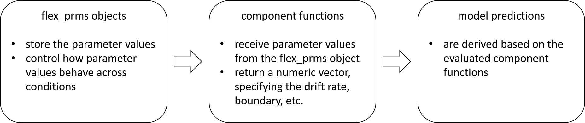

```{r, echo = FALSE, message=FALSE}
knitr::opts_chunk$set(
  collapse = TRUE,
  comment = "#>"
)
library(dRiftDM)
set.seed(1014)
```

The `dRiftDM` package provides pre-built Drift-Diffusion Models (DDMs; see `vignette("dRiftDM", "dRiftDM")`). However, one of the strengths of `dRiftDM` is that it allows you to customize models by specifying arbitrary component functions for the drift rate, boundary, etc., and how the parameters relate across conditions. 

# The Model Structure in dRiftDM

To better understand how we can customize a DDM, we first need to understand how models are structured within `dRiftDM` and how model predictions are derived. Each model in `dRiftDM` is essentially a list that has (among other things) two important entries: 

- `flex_prms_obj` containing a so-called `flex_prms` object, which controls the parameters

- `comp_funs` a list of "component" functions that represent the model's drift rate, boundary, etc.

We can see these entries by addressing the labels of the underlying list:

```{r}
a_model <- ratcliff_dm() # some model
names(a_model) # the entries of the underlying list
```
With the  `flex_prms` object (stored as the first entry), we can specify the parameters of the model and also control how each parameter relates across conditions. For example, we could specify that a parameter `A` in condition `incomp` is the negative of parameter `A` in condition `comp`. Or we could specify that a parameter `muc` is estimated separately for two conditions. 

With the functions stored in `comp_funs` (the fourth entry), we can control the drift rate, boundary, starting point, and non-decision time. Each function takes a set of arguments, including the model parameters, and returns a vector of values. For example, the drift rate function returns the drift rate of the diffusion model for each time step. 

When deriving the model predictions, the `comp_funs` are evaluated with the currently set parameter values controlled by the `flex_prms` object. Dedicated numerical algorithms in the depths of `dRiftDM` then derive the model's predicted probability density functions of response times, separately for each possible response choice. It is important to emphasize this interaction of `comp_funs` with the `flex_prms` object, as you will need to ensure that the two work together smoothly. For example, a function stored in `comp_funs` might fail if it is given a parameter vector that it does not expect. Or a model might not work as expected if a function stored in `comp_funs` doesn't consider a certain parameter. The workflow is emphasized in the following diagram:

```{r, echo=FALSE, out.width = '90%'}

```

Given this, there are two ways to customize a model, and depending on the problem, you may need to consider both or only one.

1.) You can modify a model's `flex_prms` object. This is relevant whenever you want to change how the parameters of a model relate across conditions.

2.) You can customize the component functions. This is relevant whenever you want to have a different drift rate, boundary, starting point, or non-decision time.


# Modifying `flex_prms` objects

We can access the underlying `flex_prms` object of a model with the generic `flex_prms()` accessor method: 

```{r}
# Create a model (here the Diffusion Model for Conflict Tasks, DMC)
ddm <- dmc_dm()
flex_prms(ddm)
```

Here we see the two core aspects of any `flex_prms` object (see also the first print statement in `vignette("dRiftDM", "dRiftDM")` for more information): 

- The **Parameter Values** shows you the current parameter values for all conditions. 

- The **Parameter Settings** show how each parameter behaves across conditions. 

## Modifying How Each Parameter Behaves Across Conditions

The **Parameter Settings** are relevant to model customization, and we can change them with the `modify_flex_prms()` method. The function takes a model and a set of **instructions** as a string. For example, if we want `muc` to vary freely across conditions, we can write

```{r}
ddm_free_muc <- modify_flex_prms(
  ddm, # the model
  instr = "muc ~" # an instructions in a formula-like format
)
flex_prms(ddm_free_muc)
```
Since there are now two numbers for `muc` under **Parameter Settings**, this parameter can take different values for different conditions. This is also why `coef()` now provides two (modifiable) values for `muc` per condition:

```{r}
coef(ddm) # in this model muc is the same for all conditions

coef(ddm_free_muc) # here muc can be different for the conditions

coef(ddm_free_muc)[1] <- 5
coef(ddm_free_muc)
```


`modify_flex_prms()` supports the following instructions (see the documentation for the syntax of each instruction):

- The vary instruction: Allows parameters to be estimated independently across conditions.

- The "restrain" instruction: Forces parameters to be identical across conditions.

- The "fix" instruction: Keeps parameters constant. They don't vary while the remaining parameters are estimated.

- The "special dependency" instruction: Sometimes we want a parameter in one condition to depend on another parameter in a second condition. An example of this is already shown in the `flex_prms(ddm)` output above. Here the parameter `A` in the condition `incomp` is the negative of the parameter in the condition `comp`.

- The "custom parameter" instruction: Sometimes, we want to calculate a linear combination of the model parameters. An example for this is already shown in the `flex_prms(ddm)` output above. Here, we have the custom parameter `peak_l` (for "peak latency"), which is `peak_l = (a-1)*tau` (the equation is not apparent from the output). 

## Defining New Conditions

The current conditions of a model can be accessed with the `conds()` method:

```{r}
conds(ddm)
```
We can assign new values to change these conditions. For example, a researcher may want to introduce a neutral condition:

```{r}
conds(ddm) <- c("comp", "neutral", "incomp")
```
Here we receive a message reminding us that all parameter values have been reset. In fact, when we print out the underlying `flex_prms` object, we see that the previous settings are gone (e.g., `A` in the `incomp` condition is no longer the negative of `A` in the `comp` condition):

```{r}
flex_prms(ddm)
```
While this may be a bit annoying in some cases, it actually makes sense because there is no way for dRiftDM to know how the new conditions relate to the old ones. Consequently, we now have to modify the underlying `flex_prms` object again to suit our needs. For example, we could restore the previous behavior for `A` in the `incomp` condition, while setting `A` to zero for the new `neutral` condition. We might also want to keep `a` again fixed for all conditions:

```{r}
instructions <- "
a <!>                      # 'a' is fixed across all conditions
A ~ incomp == -(A ~ comp)  # A in incomp is -A in comp
A <!> neutral              # A is fixed for the neutral condition
A ~ neutral => 0           # A is zero for the neutral condition
"

ddm <- modify_flex_prms(
  object = ddm,
  instr = instructions
)
print(ddm)
```

# Customizing Component Functions

As mentioned above, another way to customize a model is to change the component functions for the drift rate, boundary, start point, or non-decision time. We can access each component function using the `comp_funs()` method:

```{r}
ddm <- dmc_dm() # some pre-built model
names(comp_funs(ddm))
```

- `mu_fun()` and `mu_int_fun()` return the drift rate and its integral. The integral is required as an entry, but is only evaluated if the user chooses the non-default method "im_zero" to derive model predictions.

- `x_fun()` returns the density for the initial distribution.

- The `b_fun()` and `dt_b_fun()` functions returns the (upper) boundary and its derivative, respectively.

- Finally, `nt_fun()` returns the density of the non-decision time.

A number of predefined component functions are already available via `component_shelf()` (see the documentation for a description of each function): 
```{r}
all_funs <- component_shelf()
names(all_funs)
```

The structure of each of these component functions is generally the same. The drift rate, boundary, and non-decision time functions (i.e., `mu_fun`, `mu_int_fun`, `b_fun`, `dt_b_fun`, and `nt_fun`) must have the following declaration: 

```{r, eval = F}
... <- function(prms_model, prms_solve, t_vec, one_cond, ddm_opts) {
  ...
}
```


- `prms_model` is a named numeric vector and is identical to a row of the **Parameter Values** stored within the `flex_prms` object of a model (see the first part of the following output).

```{r}
flex_prms(ddm)
```

- `prms_solve` is a named numeric vector, including the diffusion constant and the discretization settings. It is identical to:

```{r}
prms_solve(ddm)
```

- `t_vec` is a numeric vector, representing the time space. It is constructed from `dt` and `t_max`:

```{r}
t_max <- prms_solve(ddm)["t_max"]
dt <- prms_solve(ddm)["dt"]
t_vec <- seq(0, t_max, dt)
head(t_vec)
tail(t_vec)
```

- `one_cond` is the label of the current condition for which the model is being evaluated (i.e., a row name of the **Parameter Values**).

- `ddm_opts` is taken directly from the model. It is used as a backdoor to inject arbitrary `R` objects (see the final comments below for an example)

Each drift rate, boundary, and non-decision time function must return a numeric vector of the same length as `t_vec` (see below for examples). 

- For the drift rate, these returned values represent the drift rate (or its integral) at each time step. 

- For the boundary (or its derivative), these values are the boundary values returned for the upper boundary at each time step. The lower boundary is always assumed to be the negative of the upper boundary. That is, the bounds are symmetric about zero.

- Finally, the values returned for the non-decision time represent the density values of the respective distribution. 

The declaration for the starting point function, `x_fun`, is similar, with one exception. It must take the argument `x_vec`:

```{r, eval = F}
... <- function(prms_model, prms_solve, x_vec, one_cond, ddm_opts) {
  ...
}
```

- `x_vec` is a numeric vector, with the (standardized) evidence space. It is constructed from `dx` and spans from -1 to 1:

```{r}
dx <- prms_solve(ddm)["dx"]
x_vec <- seq(-1, 1, dx)
```

Each starting point function must return a numeric vector of the same length as `x_vec`, providing the density values of the starting points over the evidence space.

In theory, you can simply replace component functions using the replacement method for `comp_funs()`. However, at runtime, the values for the arguments `prms_model` and `one_cond` come from a row of the model's parameter matrix (i.e., from the underlying `flex_prms` object). Thus, you must ensure that each component function can handle the values supplied. Consequently, directly swapping functions only makes sense when the model parameters remain the same. The more general approach is to write a function that assembles the model.

The following sections provide examples for a custom ...

- ... drift rate (Example 1)
- ... starting point (Example 2)
- ... boundary (Example 3)
- ... non-decision time (Example 4)

## Example 1: Custom Drift Rate

Assume that we want a model with the following custom drift rate: 
$$\mu(t) = \left\{ 
  \begin{array}{ c l }
    \mu_c + \mu_a & \quad \textrm{for compatible conditions} \\
    \mu_c - \mu_a & \quad \textrm{for incompatible conditions}
  \end{array}
\right.$$
Thus, in compatible conditions, the drift rate at each time step is the sum of the two drift rates $\mu_c$ and $\mu_a$, while in incompatible conditions it is their difference. 

First, we write the corresponding drift rate function like this: 

```{r}
cust_mu <- function(prms_model, prms_solve, t_vec, one_cond, ddm_opts) {
  # extract all parameters (one row of the parameter matrix)
  muc <- prms_model[["muc"]]
  mua <- prms_model[["mua"]]
  sign <- prms_model[["sign"]]

  # and return the drift rate at each time step
  mu <- rep(muc + sign * mua, length(t_vec))
  return(mu)
}
```

Within this function, we first extract the model parameters relevant to the calculation of the drift rate. Then, depending on an auxiliary parameter `sign`, we sum both parameters and return the vector of drift rates for each time step. 


The next step is to create a function that assembles the custom model by calling dRiftDM's backbone function `drift_dm()`. Here we define vectors for all model parameters and conditions. We then assemble the model using not only our custom drift rate function, but also pre-built functions for the boundary, start point, and non-decision time.^[It would also be possible to omit the pre-built functions for the boundary, start point, and non-decision time. In this case dRiftDM will fall back to default settings, see also the documentation for `comp_funs()`] Finally, we ensure that the auxiliary sign parameter works as intended by modifying the parameter settings with `modify_flex_prms()`:

```{r}
cust_model <- function() {
  # define all parameters and conditions
  prms_model <- c(
    muc = 3, # parameters for the custom drift rate function
    mua = 1,
    sign = 1, 
    b = .6, # parameter for a time-independent boundary "b"
    non_dec = .2 # parameter for a non-decision time "non_dec"
  )
  conds <- c("comp", "incomp")

  # get access to pre-built component functions
  comps <- component_shelf()

  # call the drift_dm function which is the backbone of dRiftDM
  ddm <- drift_dm(
    prms_model = prms_model,
    conds = conds,
    subclass = "my_custom_model",
    mu_fun = cust_mu, # your custom drift rate function
    mu_int_fun = comps$dummy_t, # a dummy function, because no integral
    # of the drift rate is required per default
    x_fun = comps$x_dirac_0, # pre-built dirac delta on zero for the starting point
    b_fun = comps$b_constant, # pre-built time-independent boundary with parameter b
    dt_b_fun = comps$dt_b_constant, # pre-built derivative of the boundary
    nt_fun = comps$nt_constant # pre-built non-decision time with parameter non_dec
  )

  # modify the flex_prms object to achieve the desired behavior of 'sign'
  # -> don't consider 'sign' a free parameter to estimate and set it to -1
  # for incompatible conditions
  ddm <- modify_flex_prms(
    ddm,
    instr = "sign <!>
                                        sign ~ incomp => -1"
  )

  return(ddm)
}

ddm <- cust_model()
```

If we want to use the "im_zero" method to derive model predictions, we also need to write a function for the integral of the drift rate:^[The "im_zero" method is provided for backward compatibility, the default "kfe" method is recommended.] 

```{r}
cust_mu_int <- function(prms_model, prms_solve, t_vec, one_cond, ddm_opts) {
  # extract all parameters (one row of the parameter matrix)
  muc <- prms_model[["muc"]]
  mua <- prms_model[["mua"]]
  sign <- prms_model[["sign"]]

  # and return the integral of the drift rate
  mu <- (muc + sign * mua) * t_vec
  return(mu)
}
```

This function is then passed to the `mu_int_fun` argument within the `cust_model()` function. Everything else is the same.


```{r, eval = F, echo = F}
cust_model <- function() {
  # define all parameters and conditions
  prms_model <- c(
    muc = 3,  # prms for the custom drift rate function
    mua = 1,
    sign = 1,
    b = .6, # parameter for a time-independent boundary b
    non_dec = .2
  ) # parameter for a non-decision time
  conds <- c("comp", "incomp")

  # get access to pre-build component functions
  comps <- component_shelf()

  # call the drift_dm function which is the backbone of dRiftDM
  ddm <- drift_dm(
    prms_model = prms_model,
    conds = conds,
    subclass = "my_custom_model",
    mu_fun = cust_mu, # custom defined
    mu_int_fun = cust_mu_int, # to test :)
    x_fun = comps$x_dirac_0, # dirac delta on zero for the starting point
    b_fun = comps$b_constant, # time-independent boundary with parameter b
    dt_b_fun = comps$dt_b_constant, # respective derivative of the boundary
    nt_fun = comps$nt_constant # non-decision time with parameter non_dec
  )

  # modify the flex_prms object to achieve the desired behavior of 'sign'
  # -> don't consider 'sign' a free parameter to estimate and set it to -1
  # for incompatible conditions
  ddm <- modify_flex_prms(
    ddm,
    instr = "sign <!>
             sign ~ incomp => -1"
  )

  return(ddm)
}

ddm <- cust_model()
pdf_vals <- pdfs(ddm)
plot(pdf_vals$pdfs$comp$pdf_u)
```

## Example 2: Custom Starting Point (Distribution)

Suppose we want a model where the starting point of the diffusion process is controlled by a parameter $z$. If $z = 0.5$, the starting point is zero. If $0.5 < z < 1$, the starting point is closer to the upper boundary. If $0 < z < 0.5$, the start point is closer to the lower boundary. Such a custom starting point distribution might look like this: 


```{r}
cust_x <- function(prms_model, prms_solve, x_vec, one_cond, ddm_opts) {
  dx <- prms_solve[["dx"]]
  z <- prms_model[["z"]]
  stopifnot(z > 0, z < 1)

  # create a dirac delta for the starting point
  x <- numeric(length = length(x_vec))
  index <- round(z * (length(x) - 1)) + 1
  x[index] <- 1 / dx # make sure it integrates to 1
  return(x)
}
```

Then we write a function that assembles the custom model:

```{r}
cust_model <- function() {
  # define all parameters and conditions
  prms_model <- c(
    z = .75, # parameter for the custom starting point
    muc = 4, # parameter for a time-independent drift rate "muc"
    b = .6, # parameter for a time-independent boundary "b"
    non_dec = .2 # parameter for a non-decision time "non_dec"
  )

  # each model must have a condition (in this example it is not relevant, so we just call it "foo")
  conds <- c("foo")

  # get access to pre-built component functions
  comps <- component_shelf()

  # call the drift_dm function which is the backbone of dRiftDM
  ddm <- drift_dm(
    prms_model = prms_model,
    conds = conds,
    subclass = "my_custom_model",
    mu_fun = comps$mu_constant, # time-independent drift rate with parameter muc
    mu_int_fun = comps$mu_int_constant, # respective integral of the drift rate
    x_fun = cust_x, # custom starting point function with parameter z
    b_fun = comps$b_constant, # time-independent boundary with parameter b
    dt_b_fun = comps$dt_b_constant, # respective derivative of the boundary
    nt_fun = comps$nt_constant # non-decision time with parameter non_dec
  )
  return(ddm)
}

ddm <- cust_model()
```

## Example 3: Custom Boundary

Remark: This example shows a reimplementation of the already pre-built `b_hyperbol()` and `dt_b_hyperbol()` component functions (see `component_shelf()`). If you want a model with a collapsing boundary, just jump to the `cust_model` R chunk below and plug in the respective pre-built component functions. 

Suppose we want collapsing boundaries. The formula for the upper boundary should be
$$b(t) = b_0 \left(1-\kappa\cdot \frac{t}{t+t_{0.5}}\right)\,,$$
where $b_0$ is the initial value of the upper boundary, $\kappa$ is the rate of collapse, and $t_{0.5}$ is the time at which the boundary has collapsed by half. Since `dRiftDM` assumes symmetric boundaries, the lower bound is $-b(t)$. 

The corresponding R function for this is: 

```{r}
# the boundary function
cust_b <- function(prms_model, prms_solve, t_vec, one_cond, ddm_opts) {
  b0 <- prms_model[["b0"]]
  kappa <- prms_model[["kappa"]]
  t05 <- prms_model[["t05"]]

  return(b0 * (1 - kappa * t_vec / (t_vec + t05)))
}
```

To make this work with `dRiftDM`, we also provide the derivative of the boundary:
$$\frac{d}{dt} b(t) = -\left(\frac{b_0 \cdot \kappa \cdot t_{0.5}}{(t + t_{0.5})^2}\right)\,.$$

The corresponding R function for this is: 

```{r}
# the derivative of the boundary function
cust_dt_b <- function(prms_model, prms_solve, t_vec, one_cond, ddm_opts) {
  b0 <- prms_model[["b0"]]
  kappa <- prms_model[["kappa"]]
  t05 <- prms_model[["t05"]]

  return(-(b0 * kappa * t05) / (t_vec + t05)^2)
}
```


Then we write a function that assembles the custom model;


```{r}
cust_model <- function() {
  # define all parameters and conditions
  prms_model <- c(
    b0 = .6, # parameters for the custom boundary
    kappa = .5,
    t05 = .15,
    muc = 4, # parameter for a time-independent drift rate "muc"
    non_dec = .2 # parameter for a non-decision time "non_dec"
  )

  # each model must have a condition 
  # (in this example it is not relevant, so we just call it "foo")
  conds <- c("foo")

  # get access to pre-built component functions
  comps <- component_shelf()

  # call the drift_dm function which is the backbone of dRiftDM
  ddm <- drift_dm(
    prms_model = prms_model,
    conds = conds,
    subclass = "my_custom_model",
    mu_fun = comps$mu_constant, # time-independent drift rate with parameter muc
    mu_int_fun = comps$mu_int_constant, # respective integral of the drift rate
    x_fun = comps$x_dirac_0, # dirac delta on zero
    b_fun = cust_b, # custom time-dependent boundary
    dt_b_fun = cust_dt_b, # respective derivative of the boundary
    nt_fun = comps$nt_constant # non-decision time with parameter non_dec
  )
  return(ddm)
}
ddm <- cust_model()
```


```{r, eval = F, echo = F}
plot(
  simulate_traces(ddm, 1, sigma = 0)
)
```

## Example 4: Custom Non-Decision Time

Remark: This example shows a reimplementation of the already pre-built `nt_uniform()` component function (see `component_shelf()`.

Suppose we want a uniform non-decision time distribution with parameters `non_dec` and `range_non_dec`: 
```{r}
cust_nt <- function(prms_model, prms_solve, t_vec, one_cond, ddm_opts) {
  # get the relevant parameters
  non_dec <- prms_model[["non_dec"]]
  range_non_dec <- prms_model[["range_non_dec"]]

  # get the settings for the time space discretization
  t_max <- prms_solve[["t_max"]]
  dt <- prms_solve[["dt"]]

  # calculate the density
  d_nt <- dunif(x = t_vec, min = non_dec - range_non_dec / 2, max = non_dec + range_non_dec / 2)
  d_nt <- d_nt / (sum(d_nt) * dt) # ensure it integrates to 1
  return(d_nt)
}
```

Then we write a function that assembles the custom model:

```{r}
cust_model <- function() {
  # define all parameters and conditions
  prms_model <- c(
    non_dec = .2, # parameters for the custom non-decision time
    range_non_dec = .05,
    muc = 4, # parameter for a time-independent drift rate
    b = .6 # parameter for a time-independent boundary
  )

  # each model must have a condition
  # (in this example it is not relevant, so we just call it "foo")
  conds <- c("foo")

  # get access to pre-built component functions
  comps <- component_shelf()

  # call the drift_dm function which is the backbone of dRiftDM
  ddm <- drift_dm(
    prms_model = prms_model,
    conds = conds,
    subclass = "my_custom_model",
    mu_fun = comps$mu_constant, # time-independent drift rate with parameter muc
    mu_int_fun = comps$mu_int_constant, # respective integral of the drift rate
    x_fun = comps$x_dirac_0, # dirac delta on zero
    b_fun = comps$b_constant, # time-independent boundary b
    dt_b_fun = comps$dt_b_constant, # respective derivative of the boundary
    nt_fun = cust_nt # custom non-decision time
  )
  return(ddm)
}
ddm <- cust_model()
```

```{r, eval = F, echo = F}
plot(ddm, bundle_plots = FALSE)
```

## Final Comments

**More Examples?** The previous examples have shown you how to tailor a model to your needs using custom component functions. For more examples and inspiration, we suggest you take a look at the source code of the predefined component functions. A list of all component functions can be found in the documentation for `component_shelf()`.

```{r, eval = F}
?component_shelf
```

The source code for each function is available on our Github page [here](https://github.com/bucky2177/dRiftDM/blob/main/R/models.R). Alternatively, you can access the source code from R like this: 
```{r, eval = F}
all_funs <- component_shelf() # all functions
View(all_funs$x_uniform) # see the code for x_uniform
```

**How do I check that the model is working as intended?** There are three ways to perform sanity checks. First, to check the boundary and drift rate, you can plot the expected time course of your diffusion model: 

```{r}
ddm <- dmc_dm()
test <- simulate_traces(ddm, k = 1, sigma = 0, add_x = FALSE)
plot(test)
```

Alternatively, you can plot the returned values of each component function by passing the model object to the generic `plot()` method:
```{r}
plot(ddm, col = c("green", "red"), bundle_plots = FALSE)
```

Finally, if you know what the model predictions should look like, you can request these model predictions using the `calc_stats()` function.

```{r}
stats <- calc_stats(ddm, type = "quantiles")
plot(stats)
```

**How do I choose values for `dt` and `dx`?**

By default, `dRiftDM` sets `dt` and `dx` to 0.001, which is very conservative --- we don’t know which models you will create, so we’d rather be safe than sorry. In many cases, though, these settings are unnecessarily small, leading to slow evaluations and high computational burden. For the pre-built models, we therefore use larger `dt` and `dx` values chosen after extensive model simulations.

```{r}
prms_solve(dmc_dm())
```

To help choose discretization settings, we provide `check_discretization()`. It derives model predictions under the current discretization and compares them to predictions obtained under a fine discretization (with `dx` = `dt` = 0.001), separately for each condition, using the Hellinger distance.

```{r}
cust_model <- cust_model() # some custom model
# set the intended discretization setting
prms_solve(cust_model)["dx"] = .01
prms_solve(cust_model)["dt"] = .005

# compare to a precise solution
check_discretization(cust_model)
```

The result is a per-condition deviance measure. If the predictions match exactly under both coarse and fine discretizations, the value is 0; if they are completely different, the value is 1. As a rule of thumb, we recommend keeping the deviance well below 5% for the parameter values that matter.

With `check_discretization()` in hand, it’s straightforward to write small loops to explore parameter values and discretization settings.

In addition, we can run small model-recovery studies to assess how discretization affects the reliability of parameter estimates.


**What if I need to access an arbitrary R object within a component function?** Since each component function is called by `dRiftDM` at runtime, users don't have direct control over the values passed as arguments. However, we have implemented a backdoor via the `ddm_opts` argument of each component function. This allows you to inject arbitrary R objects and evaluate them at runtime if necessary. The following (not very creative) example shows how to do this. 

First, we write a custom component function that prints the `ddm_opts` argument to the console. We then attach the string "Hello World" to a model via the `ddm_opts()` method, set the custom component function, and see the corresponding console output after calling `re_evaluate()`.

```{r}
cust_mu <- function(prms_model, prms_solve, t_vec, one_cond, ddm_opts) {
  print(ddm_opts) # print out the values of ddm_opts
  muc <- rep(prms_model[["muc"]], length(t_vec))
  return(muc)
}

a_model <- ratcliff_dm() # a dummy model for demonstration purpose
ddm_opts(a_model) <- "Hello World" # attach "Hello World" to the model
comp_funs(a_model)[["mu_fun"]] <- cust_mu # swap in the custom component function

# evaluate the model (which will evaluate the custom drift rate function with the user-defined R
# object for ddm_opts)
a_model <- re_evaluate_model(a_model)
```

Because R is dynamic, we can attach arbitrary R objects and even functions to the model via `ddm_opts` and thereby make them available within our custom component functions.


# Remark: Trial-by-Trial Variability in the Drift Rate

dRiftDM supports trial-by-trial variability in the drift rate for models with a time-independent (within-trial) drift rate. Its implementation is slightly different, however, as there is no dedicated model component for this feature. Instead, while solving the model, dRiftDM systematically increases and decreases the drift rate parameter to derive the first-passage-time distribution five times with different drift rates, and then averages across these distributions. As a consequence, we should expect computation time to increase by roughly a factor of five.

**Two ingredients are required:**

1. we need a model with the `mu_constant` component function  
2. we need to add the parameter `sd_muc` to the model. This internally triggers trial-by-trial variability in the drift rate

The following code shows how to create such a model. We can replace any of the component functions or parameters, except those related to `mu_constant` and `mu_int_constant`.


```{r}
cust_model <- function() {
  # define all parameters and conditions
  prms_model <- c(
    non_dec = .2, # parameters for the non-decision time
    muc = 3, # parameter for a time-independent drift rate
    sd_muc = 1.2, # will trigger trial-by-trial variability in the drift rate!
    b = .4 # parameter for a time-independent boundary
  )

  # each model must have a condition
  # (in this example it is not relevant, so we just call it "foo")
  conds <- c("foo")

  # get access to pre-built component functions
  comps <- component_shelf()

  # call the drift_dm function which is the backbone of dRiftDM
  ddm <- drift_dm(
    prms_model = prms_model,
    conds = conds,
    subclass = "my_custom_model",
    mu_fun = comps$mu_constant, # time-independent drift rate with parameter muc
    mu_int_fun = comps$mu_int_constant, # respective integral of the drift rate
    x_fun = comps$x_dirac_0, # dirac delta on zero
    b_fun = comps$b_constant, # time-independent boundary b
    dt_b_fun = comps$dt_b_constant, # respective derivative of the boundary
    nt_fun = comps$nt_constant # time-independent non-decision time
  )
  return(ddm)
}

my_model <- cust_model()

# simulate some traces
set.seed(1)
plot(
  simulate_traces(my_model, k = 10, sigma = 0)
)

# visualize the effect of trial-by-trial variability: slow errors
plot(
  calc_stats(my_model, type = "cafs")
)
```


